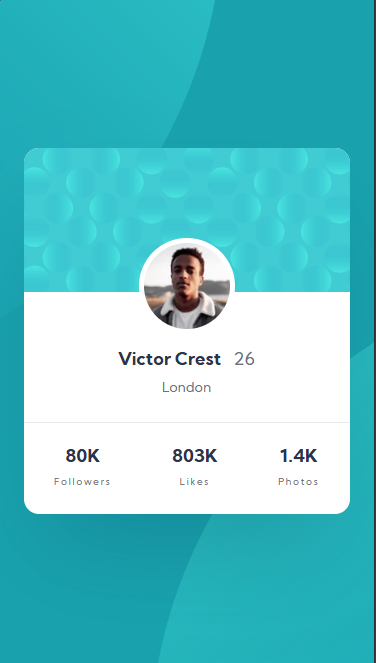
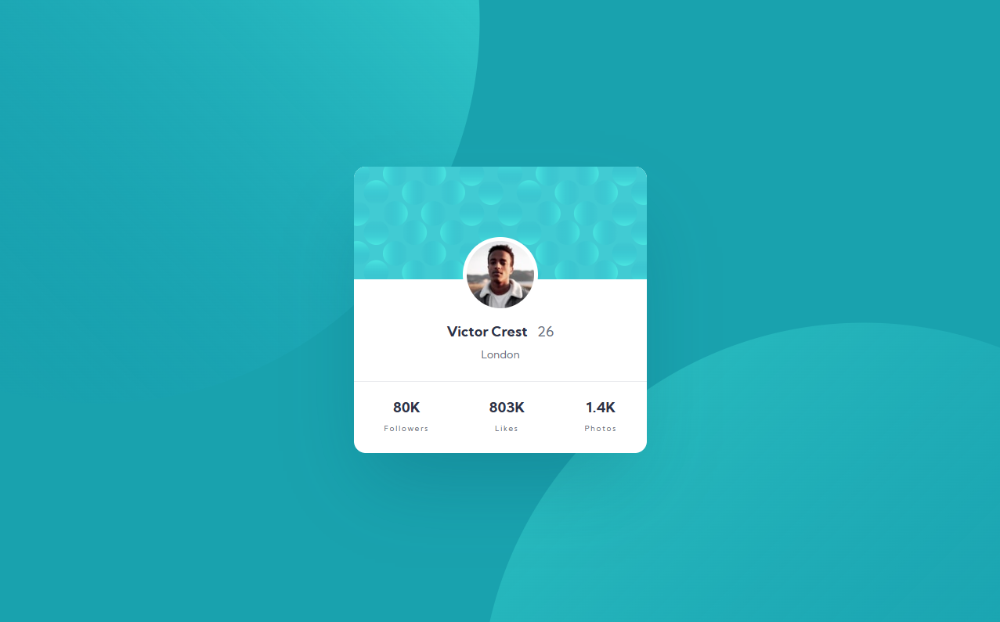

# Frontend Mentor - Profile card component solution

This is my professional solution to the [Profile card component challenge on Frontend Mentor](https://www.frontendmentor.io/challenges/profile-card-component-cfArpWshJ). 

## Table of contents

- [Overview](#overview)
  - [The challenge](#the-challenge)
  - [Links](#links)
  - [Screenshot](#screenshot)
  - [Tech Stack](#tech-stack)
- [My Process & Architecture](#my-process--architecture)
  - [What I learned](#what-i-learned)
- [Author](#author)

## Overview

### The challenge

The main objective of this challenge is to build a responsive profile card component and master the fluid positioning of complex decorative background patterns according to the provided Figma design.

### Links

- **Solution URL:** [Profile card component](https://github.com/Osty-trainee/Profile-card-component)
- **Live Site URL:** [Profile card component](https://osty-trainee.github.io/Profile-card-component/)

### Screenshot

🎨 **Desktop View:**

📱 **Mobile View:**

### Tech Stack

- Semantic HTML5 markup
- **BEM (Block Element Modifier)** methodology for clean class naming
- **SCSS (Sass)** with a modular architecture
- CSS Custom Properties (`:root`) for the design system (colors and spacing)
- **`rem`** units for ultimate scalability and responsiveness
- **Flexbox** for pixel-perfect vertical and horizontal centering
- **Mobile-First** approach utilizing custom SCSS media query mixins

## My Process & Architecture

The styles in this project are decoupled into clean, maintainable SCSS partials:
- `_variables.scss` — Contains CSS custom properties, variables, and the `@mixin mq-large` media query mixin.
- `_fonts.scss` — Local font configuration for the *Kumbh Sans* typeface via `@font-face`.
- `_reset.scss` — Global CSS reset and fluid background pattern alignment.
- `_card.scss` — Scoped styling for the profile card component itself.
- `main.scss` — The main entry point compiling all partials into a unified sheet.

### What I learned

1. **Advanced Media Query Mixins for Responsive Layouts:** Implemented a professional architectural approach by creating a reusable SASS mixin (`@mixin mq-large`) linked to a single `$breakpoint-tablet: 768px` variable. This technique encapsulates the responsive logic for larger screens. Since the tablet and desktop layouts are identical, this custom mixin allows the layout to seamlessly transition from mobile format straight to larger viewports without writing redundant `@media (min-width: ...)` rules throughout the codebase, keeping the styles DRY (Don't Repeat Yourself).
2. **Fluid Background Positioning:** Combining `vw` and `vh` units with media query mixins allowed me to lock the massive SVG circles into the desktop corners seamlessly, completely preventing horizontal scrolling (`overflow-x: hidden`).
3. **Element Overlapping (Avatar):** Successfully executed the overlapping of the user avatar right on the edge of the card's header and body using negative `margin-top` values paired with SASS `calc()`.
4. **Accessibility Best Practices:** Converted all dimensions from static pixels to relative `rem` units to ensure proper text scaling according to user browser configurations.

## Author

- GitHub - [Osty-trainee](https://github.com/Osty-trainee)
- Frontend Mentor - [@Osty-trainee](https://www.frontendmentor.io/profile/Osty-trainee)
